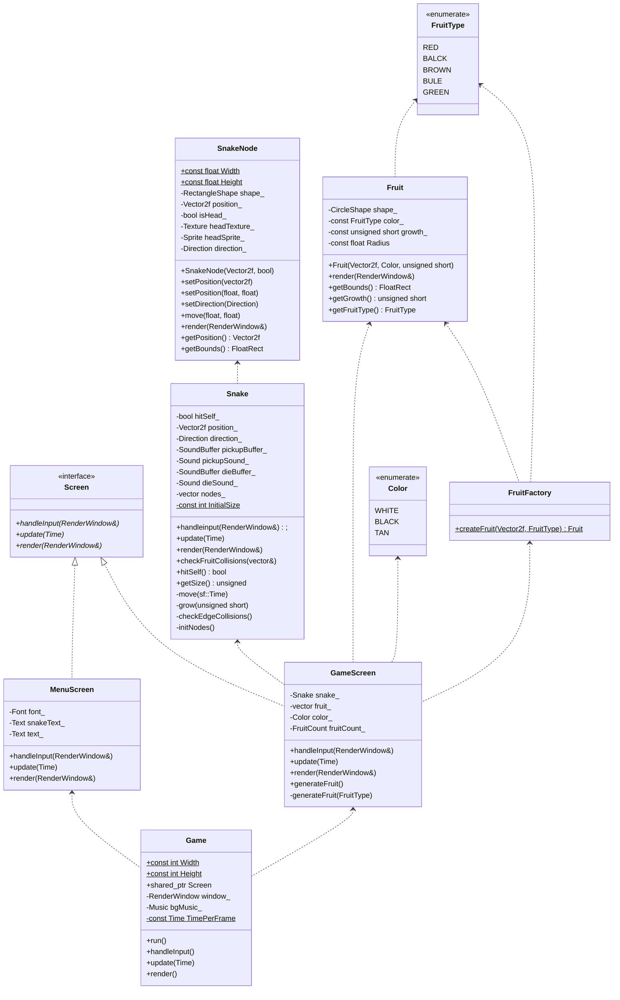
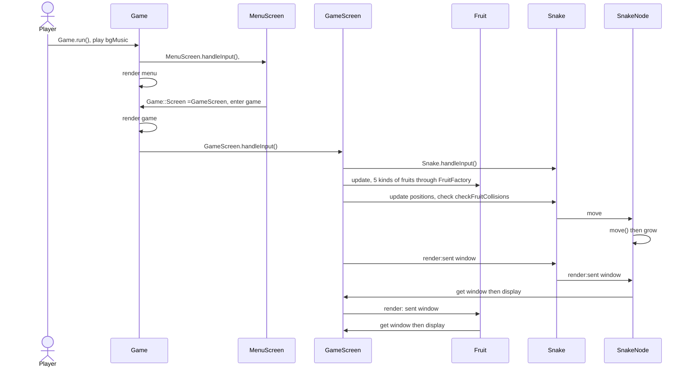
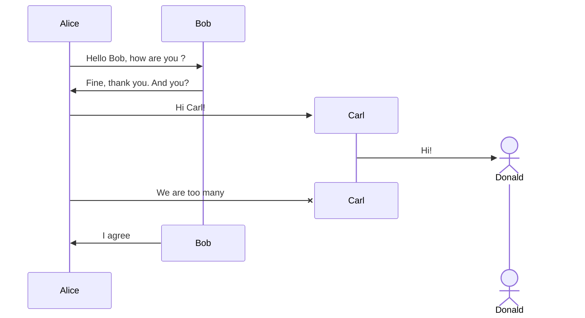

```mermaid
classDiagram
	class Game{
		+const int Width$
		+const int Height$
		+shared_ptr<Screen> Screen
		+run()
		+handleInput()
		+update(Time)
		+render()
		-RenderWindow window_
		-Music bgMusic_
		-const Time TimePerFrame$
	}
	
	class MenuScreen
	MenuScreen : -Font font_
	MenuScreen : -Text snakeText_
	MenuScreen : -Text text_
	MenuScreen : +handleInput(RenderWindow&)
	MenuScreen : +update(Time)
	MenuScreen : +render(RenderWindow&)
	
	class Screen{
		<<interface>>
		+handleInput(RenderWindow&)*
		+update(Time)*
        +render(RenderWindow&)*
	}
	
	class Color{
		<<enumerate>>
		WHITE
		BLACK
		TAN
	}
	
	class Snake{
		+handleinput(RenderWindow&);
		+update(Time)
		+render(RenderWindow&)
		+checkFruitCollisions(vector<Fruit>&)
		+hitSelf() bool
		+getSize() unsigned
		-move(sf::Time)
		-grow(unsigned short)
		-checkEdgeCollisions()
		-initNodes()
		-bool hitSelf_
		-Vector2f position_
		-Direction direction_
		-SoundBuffer pickupBuffer_
		-Sound pickupSound_
		-SoundBuffer dieBuffer_
		-Sound dieSound_
		-vector<SnakeNode> nodes_
		-const int InitialSize$
	}
	
	class SnakeNode{
		+SnakeNode(Vector2f, bool)
		+setPosition(vector2f)
		+setPosition(float, float)
		+setDirection(Direction)
		+move(float, float)
		+render(RenderWindow&)
		+getPosition() Vector2f
		+getBounds() FloatRect
		+const float Width$
		+const float Height$
		-RectangleShape shape_
		-Vector2f position_
		-bool isHead_
		-Texture headTexture_
		-Sprite headSprite_
		-Direction direction_
	}
	
	class Fruit{
		+Fruit(Vector2f, Color, unsigned short)
		+render(RenderWindow&)
		+getBounds() FloatRect
        +getGrowth() unsigned short
        +getFruitType() FruitType
		-CircleShape shape_
		-const FruitType color_
		-const unsigned short growth_
		-const float Radius
	}
	
	class GameScreen{
		+handleInput(RenderWindow&)
		+update(Time)
		+render(RenderWindow&)
		+generateFruit()
		-generateFruit(FruitType)
		-Snake snake_
		-vector<Fruit> fruit_
		-Color color_
		-FruitCount fruitCount_
	}
	
	class FruitFactory{
		+createFruit(Vector2f, FruitType) Fruit$
	}
	
	class FruitType{
		<<enumerate>>
		RED
		BALCK
		BROWN
		BULE
		GREEN
	}
	
	Screen <|..MenuScreen
	Screen <|.. GameScreen
	Snake <.. GameScreen
	Fruit <.. GameScreen
	SnakeNode <.. Snake
	Fruit <.. FruitFactory
	FruitType <.. FruitFactory
	FruitType <.. Fruit
	Color <.. GameScreen
	FruitFactory <.. GameScreen
	MenuScreen <.. Game
	GameScreen <.. Game
```

```mermaid
sequenceDiagram
	actor Player
	participant Game
    participant MenuScreen
	participant GameScreen
	participant Fruit
	participant Snake
	Player->>Game: Game.run(), play bgMusic
	Game->>MenuScreen: MenuScreen.handleInput(), 
	Game->>Game: render menu
	MenuScreen->>Game: Game::Screen =GameScreen, enter game
	Game->>Game: render game
	Game->>GameScreen: GameScreen.handleInput()
	GameScreen->>Snake: Snake.handleInput()
	GameScreen->>Fruit: update,  5 kinds of fruits through FruitFactory
	GameScreen->>Snake: update positions, check checkFruitCollisions
	Snake->>SnakeNode : move
	SnakeNode->>SnakeNode: move() then grow
	GameScreen->>Snake: render:sent window
	Snake->>SnakeNode: render:sent window
	SnakeNode->>GameScreen: get window then display
	GameScreen->>Fruit: render: sent window
	Fruit->>GameScreen: get window then display
```

```mermaid
sequenceDiagram
    Alice->>Bob: Hello Bob, how are you ?
    Bob->>Alice: Fine, thank you. And you?
    create participant Carl
    Alice->>Carl: Hi Carl!
    create actor D as Donald
    Carl->>D: Hi!
    destroy Carl
    Alice-xCarl: We are too many
    destroy Bob
    Bob->>Alice: I agree

```

