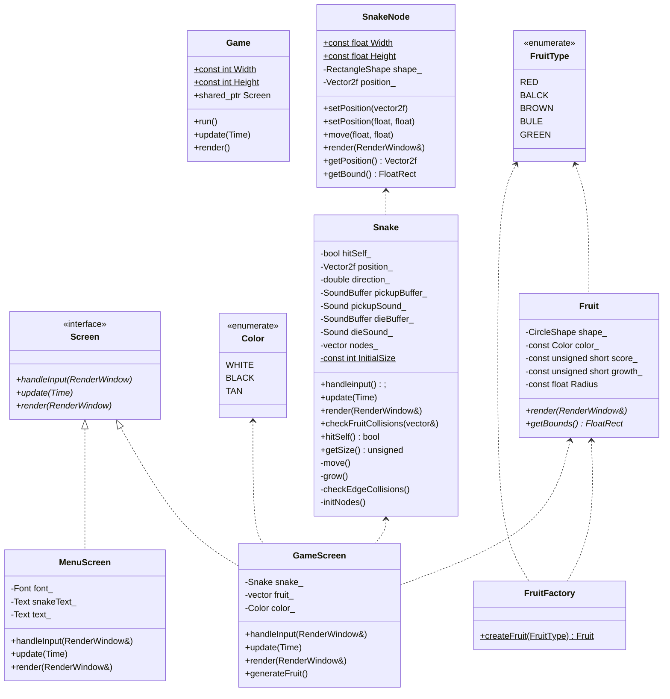

```mermaid
classDiagram
	class Game
	Game : +const int Width$
	Game : +const int Height$
	Game : +shared_ptr<Screen> Screen
	Game : +run()
	Game : +update(Time)
	Game : +render()
	
	class MenuScreen
	MenuScreen : -Font font_
	MenuScreen : -Text snakeText_
	MenuScreen : -Text text_
	MenuScreen : +handleInput(RenderWindow&)
	MenuScreen : +update(Time)
	MenuScreen : +render(RenderWindow&)
	
	class Screen{
		<<interface>>
		+handleInput(RenderWindow)*
		+update(Time)*
        +render(RenderWindow)*
	}
	
	class Color{
		<<enumerate>>
		WHITE
		BLACK
		TAN
	}
	
	class Snake{
		+handleinput();
		+update(Time)
		+render(RenderWindow&)
		+checkFruitCollisions(vector<Fruit>&)
		+hitSelf() bool
		+getSize() unsigned
		-move()
		-grow()
		-checkEdgeCollisions()
		-initNodes()
		-bool hitSelf_
		-Vector2f position_
		-double direction_
		-SoundBuffer pickupBuffer_
		-Sound pickupSound_
		-SoundBuffer dieBuffer_
		-Sound dieSound_
		-vector<SnakeNode> nodes_
		-const int InitialSize$
	}
	
	class SnakeNode{
		+setPosition(vector2f)
		+setPosition(float, float)
		+move(float, float)
		+render(RenderWindow&)
		+getPosition() Vector2f
		+getBound() FloatRect
		+const float Width$
		+const float Height$
		-RectangleShape shape_
		-Vector2f position_
	}
	
	class Fruit{
		+render(RenderWindow&)*
		+getBounds() FloatRect*
		-CircleShape shape_
		-const Color color_
		-const unsigned short score_
		-const unsigned short growth_
		-const float Radius
	}
	
	class GameScreen{
		+handleInput(RenderWindow&)
		+update(Time)
		+render(RenderWindow&)
		+generateFruit()
		-Snake snake_
		-vector<Fruit> fruit_
		-Color color_
	}
	
	class FruitFactory{
		+createFruit(FruitType) Fruit$
	}
	
	class FruitType{
		<<enumerate>>
		RED
		BALCK
		BROWN
		BULE
		GREEN
	}
	
	Screen <|..MenuScreen
	Screen <|.. GameScreen
	Snake <.. GameScreen
	Fruit <.. GameScreen
	SnakeNode <.. Snake
	Fruit <.. FruitFactory
	FruitType <.. FruitFactory
	FruitType <.. Fruit
	Color <.. GameScreen
```

